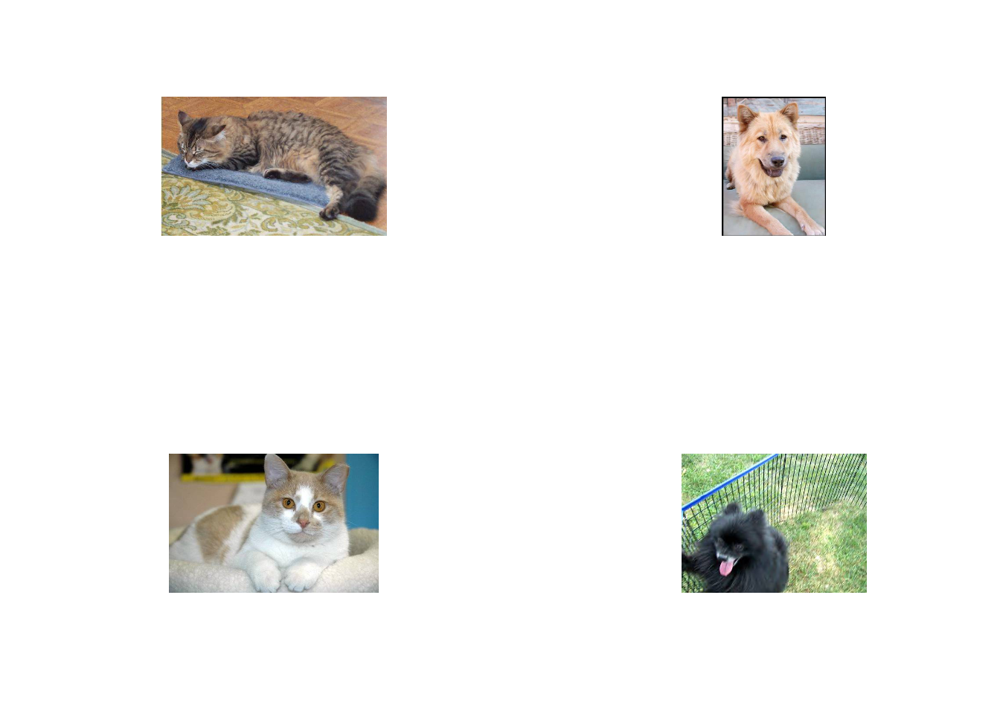
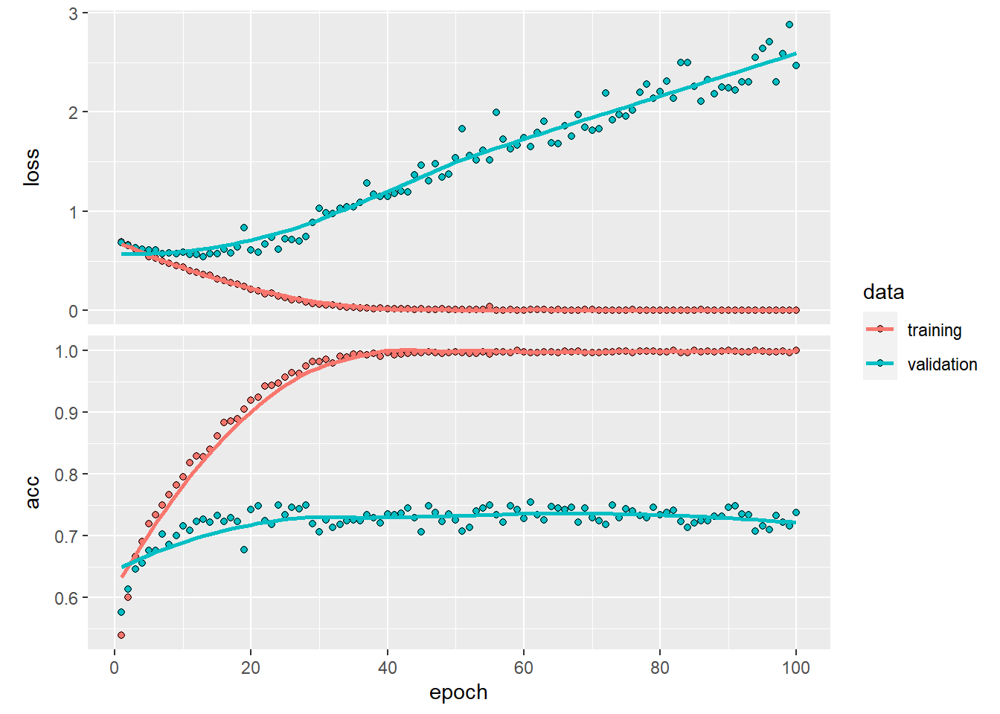
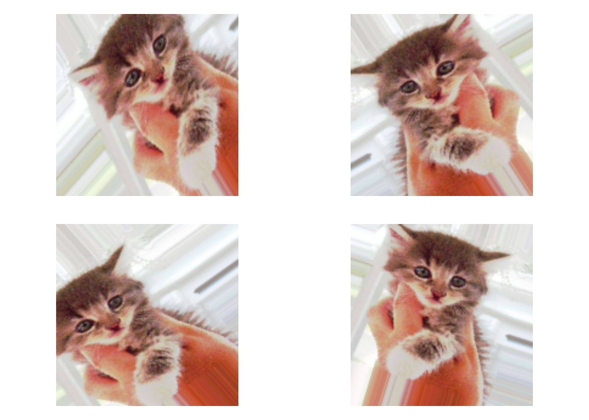
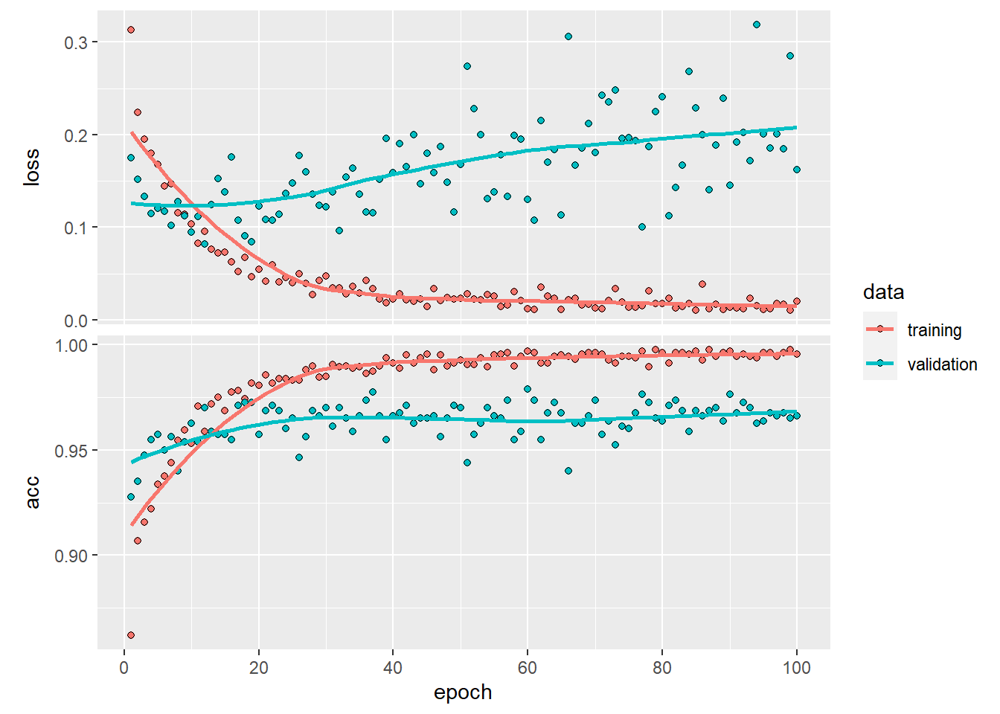
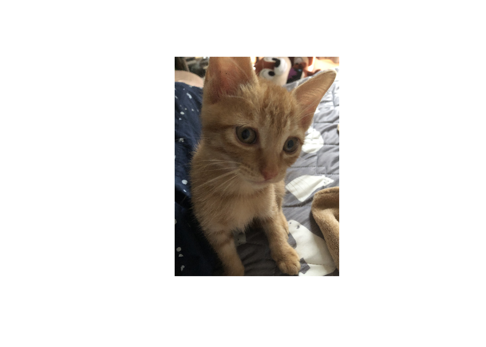

## 初めに
前回、GPUを使って機械学習をしたよという記事を書きました。でも正直あのレベルならGPUがなくてもできる。じゃあ、GPUを使って何がしたい？そう、もっと大量のデータ、ユニットを使った画像識別でしょ！ということで犬と猫を見分けるAIを作ります。最後にわが愛犬、チェリーちゃんをモデルに突っ込んでちゃんと犬と判別されるか実験するぜ！


## 犬猫判別用データを作る
今回は、Kaggleという機械学習の精度を競うプラットフォームで提供された「Dogs vs Cats」というデータを使います。犬と猫の画像が12500枚ずつ、計25000枚のカラー画像が含まれたデータです。でも今回は実践編。そんなたくさんのデータがある方が社会に出たら珍しい。そこで、今回は難易度を上げてこの中の2000枚ずつを使ってモデルを学習させてみようと思います。データが少ないと訓練用データを学習しすぎてモデルの精度が下がる過学習を起こしやすいです。工夫してやってみます。

データをダウンロードして犬と猫それぞれの画像を訓練用1000枚、評価用500枚、テスト用500枚に分けます。

```{r clean1, include=FALSE}
# 必要なパッケージの読み込み
library(keras)
library(ggplot2)
library(tidyverse)
library(magrittr)
library(mlbench)
library(tensorflow)
library(keras)
library(imager)
```

```{r dog_cat_dataimpo ,include=FALSE}
oridinal_dataset_dir <- "C:/Users/jonso/OneDrive/ドキュメント/hobby/machinelearning/train"

base_dir <- "C:/Users/jonso/OneDrive/ドキュメント/hobby/machinelearning/cats_and_dogs_small"
dir.create(base_dir)

# 画像の読み込みめんどい。ファイル管理をRでするんかい

train_dir <- file.path(base_dir,"train")
dir.create(train_dir)
validation_dir <- file.path(base_dir,"validation")
dir.create(validation_dir)
test_dir <- file.path(base_dir,"test")
dir.create(test_dir)

train_cats_dir <- file.path(train_dir,"cats")
dir.create(train_cats_dir)

train_dogs_dir <- file.path(train_dir,"dogs")
dir.create(train_dogs_dir)

validation_cats_dir <- file.path(validation_dir,"cats")
dir.create(validation_cats_dir)

validation_dogs_dir <- file.path(validation_dir,"dogs")
dir.create(validation_dogs_dir)

test_cats_dir <- file.path(test_dir,"cats")
dir.create(test_cats_dir)

test_dogs_dir <- file.path(test_dir,"dogs")
dir.create(test_dogs_dir)

fnames <- paste0("cat.",1:1000,".jpg")
file.copy(file.path(oridinal_dataset_dir, fnames),
          file.path(train_cats_dir))

fnames <- paste0("cat.",1001:1500,".jpg")
file.copy(file.path(oridinal_dataset_dir, fnames),
          file.path(validation_cats_dir))

fnames <- paste0("cat.",1501:2000,".jpg")
file.copy(file.path(oridinal_dataset_dir, fnames),
          file.path(test_cats_dir))
# ファイルデカすぎるからこれ以降は消そう
fnames <- paste0("cat.",2001:12499,".jpg")
file.remove(file.path(oridinal_dataset_dir, fnames))
# できた！

fnames <- paste0("dog.",1:1000,".jpg")
file.copy(file.path(oridinal_dataset_dir, fnames),
          file.path(train_dogs_dir))

fnames <- paste0("dog.",1001:1500,".jpg")
file.copy(file.path(oridinal_dataset_dir, fnames),
          file.path(validation_dogs_dir))

fnames <- paste0("dog.",1501:2000,".jpg")
file.copy(file.path(oridinal_dataset_dir, fnames),
          file.path(test_dogs_dir))
# ファイルデカすぎるからこれ以降は消そう
fnames <- paste0("dog.",2001:12499,".jpg")
file.remove(file.path(oridinal_dataset_dir, fnames))


```


```{r message=FALSE, warning=FALSE, collapse=TRUE}
# 中身がtrain1000、validation500、test500になってるか確認
cat("total training cat images:",length(list.files(train_cats_dir)),"\n")

cat("total training dog images:",length(list.files(train_dogs_dir)),"\n")

cat("total validation cat images:",length(list.files(validation_cats_dir)),"\n")

cat("total validation dog images:",length(list.files(validation_dogs_dir)),"\n")

cat("total test cat images:",length(list.files(test_cats_dir)),"\n")

cat("total test dog images:",length(list.files(test_dogs_dir)),"\n")
```

ちゃんと分けられています。何枚か中身を表示してみます。
```{r eval=FALSE, ,collapse=TRUE, include=FALSE}
# imagerのload.image関数を使用
img1 <- load.image("C:/Users/jonso/OneDrive/ドキュメント/hobby/machinelearning/cats_and_dogs_small/train/cats/cat.989.jpg")
img2 <- load.image("C:/Users/jonso/OneDrive/ドキュメント/hobby/machinelearning/cats_and_dogs_small/train/dogs/dog.786.jpg")
img3 <- load.image("C:/Users/jonso/OneDrive/ドキュメント/hobby/machinelearning/cats_and_dogs_small/train/cats/cat.534.jpg")
img4 <- load.image("C:/Users/jonso/OneDrive/ドキュメント/hobby/machinelearning/cats_and_dogs_small/train/dogs/dog.234.jpg")

par(mfrow = c(2,2))
plot(img1, axes = FALSE) 
plot(img2, axes = FALSE)
plot(img3, axes = FALSE)
plot(img4, axes = FALSE)

```

```{r echo=FALSE}


```

かわいいですね。でもかわいくない点が1つあります。画像の大きさや形が全然ちがーう!これだと画像データのままモデルを学習できないので形を合わせる必要があります。さらに、カラーを構成する青赤緑の成分をデコードして...めんどくさいですね。
なんとkerasにはこの過程を自動的に変換してくれるimage_data_generater()関数というスーパー便利な関数があります!さっそくやってみる。

```{r }
# 色のスケーリング
train_datagen <- image_data_generator(rescale = 1/255)
validation_datagen <- image_data_generator(rescale = 1/255)

# めっちゃ便利な関数で一括処理
train_generator <- flow_images_from_directory(
  train_dir,
  train_datagen,
  target_size = c(150,150),
  batch_size = 16,
  class_mode = "binary"
)

validation_generator <- flow_images_from_directory(
  validation_dir,
  validation_datagen,
  target_size = c(150,150),
  batch_size = 16,
  class_mode = "binary"
)

batch <- generator_next(train_generator)
str(batch)
```


20枚ずつ、150×150にそろえて0,1のラベル付けをしています。手作業でやったら時間がかかることが関数で用意されているのは便利ですね。これでデータの準備は終わり。

## まずはシンプルにモデルを作ってみる

今回はCNNと呼ばれる畳み込みニューラルネットを使います。簡単に言うと2×2や3×3のランダムな行列を画像の部分部分と内積をとることで画像の特徴を捉えることができます。また、画像の一部のうち最も大きな値を代表地として画像を圧縮するマックスプーリング層やランダムに重みをリセットするドロップアウト層も入れた本格的なモデルです。

```{r}
model <- keras_model_sequential() %>% 
  layer_conv_2d(filters = 32, kernel_size = c(3,3),activation = "relu",
                input_shape = c(150,150,3)) %>% 
  layer_max_pooling_2d(pool_size = c(2,2)) %>% 
  layer_conv_2d(filters = 64, kernel_size = c(3,3),activation = "relu") %>%
  layer_max_pooling_2d(pool_size = c(2,2)) %>% 
  layer_conv_2d(filters = 128, kernel_size = c(3,3),activation = "relu") %>%
  layer_max_pooling_2d(pool_size = c(2,2)) %>% 
  layer_conv_2d(filters = 128, kernel_size = c(3,3),activation = "relu") %>%
  layer_max_pooling_2d(pool_size = c(2,2)) %>% 
  layer_flatten() %>% 
  layer_dense(units = 512, activation = "relu") %>% 
  layer_dense(units = 1, activation = "sigmoid")

summary(model)  
```

パラメタの数が「3,453,121」まで増えています。mnistの時とはけた違いですな。

モデルが決まったらコンパイルして学習させます。

```{r cache=FALSE}
model %>% compile(
  loss = "binary_crossentropy",
  optimizer = optimizer_rmsprop(learning_rate = 1e-4),
  metrics = c("acc")
)

history <- model %>% fit(
  train_generator,
  steps_per_epoch = 100,
  epochs = 100,
  validation_data = validation_generator,
  validation_steps = 50
)


```

```{r echo=FALSE}


```

valと表示されているのが学習時にどれぐらい過学習しているかを見るための指標になります。評価データの正確度は70%程度。今回はデータが少ないため過学習するという予想の元、過学習しにくくなるような層を追加してモデルを組みました。val_lossが後半に行くにつれて増えていくのでまだ過学習を起こしてます。

## データ拡張をして、訓練済みCNNを利用する


今回、データが少ないために十分な学習を行うのが困難でした(自分で減らしたからだろ)。そこで変換器を使ったデータ拡張をしてみます。

ここでは詳しい説明は端折りますが、既存の訓練データから新たな訓練データを作ることで過学習を抑制します。

```{r}
datagen <- image_data_generator(
  rescale = 1/255,
  rotation_range = 40,
  width_shift_range = 0.2,
  height_shift_range = 0.2,
  shear_range = 0.2,
  zoom_range = 0.2,
  horizontal_flip = TRUE,
  fill_mode = "nearest"
)

# 実際の変換を見てみる

fnames <- list.files(train_cats_dir, full.names = TRUE)
img_path <- fnames[[3]]

img <- image_load(img_path, target_size = c(150,150))
img_array <- image_to_array(img)
img_array <- array_reshape(img_array, c(1, 150, 150, 3))

augmentation_generator <- flow_images_from_data(
  img_array,
  generator = datagen,
  batch_size = 1
)

op <- par(mfrow = c(2, 2), pty = "s", mar = c(1, 0, 1, 0))
for (i in 1:4) {
  batch <- generator_next(augmentation_generator)
}

```

```{r echo=FALSE}


```

一枚の画像を引き延ばしたり、反転させたり、回転させたり...
一見ずるく見えますがこれだけでも過学習を抑えることができます。

さらにさらに、1からCCNNを入れたモデルを作るのではなく、すでに訓練されたネットワークを使って、より高い制度の犬猫判別AIを作っていきます。

今回はImageNetと呼ばれる、動物や日用生活品を訓練したCNNを用いて再度学習させます。これもずるく聞こえますが、少ない画像データで機械学習をする際によく用いられる方法です。このImageNetを用いて訓練されたモデルはkerasに含まれているのでモデルの中に記述するだけで利用することができます。素晴らしいですね。今回はVGG16モデルを使用します。

```{r}
conv_base <- application_vgg16(
  weights = "imagenet",
  include_top = FALSE,
  input_shape = c(150, 150, 3)
)

conv_base
```

パラメタ数が馬鹿でかいですね。さっきのモデルにこのVGG16をくっつけていきます。今回は犬猫判別なのでVGG16の中身を壊さないよう気を付けつつ実装します。モデルはこちら

```{r}
model <- keras_model_sequential() %>% 
  conv_base() %>% 
  layer_flatten() %>% 
  layer_dense(units = 256, activation = "relu") %>% 
  layer_dense(units = 1, activation = "sigmoid")

model
```

VGG16が最初の層になっており、平たんにして接続しています。先ほどのシンプルなモデルよりさらにパラメタ数が一桁増えました。ここまでくるとCPUでは途方もない時間がかかるか、発熱しすぎて止まってしまいます(実体験)。

ここで畳み込みベースを凍結させてうんぬんがありますがとりあえずコンパイルまでスキップします。

```{r include=FALSE, cache=FALSE}
freeze_weights(conv_base)

datagen <- image_data_generator(
  rescale = 1/255,
  rotation_range = 40,
  width_shift_range = 0.2,
  height_shift_range = 0.2,
  shear_range = 0.2,
  zoom_range = 0.2,
  horizontal_flip = TRUE,
)

validation_datagen <- 
  image_data_generator(rescale = 1/255)

# 生成器の作成

train_generator <- flow_images_from_directory(
  train_dir,
  datagen,
  target_size = c(150, 150),
  batch_size = 16,
  class_mode = "binary"
)

validation_generator <- flow_images_from_directory(
  validation_dir,
  validation_datagen,
  target_size = c(150, 150),
  batch_size = 16,
  class_mode = "binary"
)

```

```{r}

# モデルのコンパイル
model %>% compile(
  loss = "binary_crossentropy",
  optimizer = optimizer_rmsprop(learning_rate = 2e-5),
  metrics = c("acc")
)

```

コンパイルが済んだので学習させましょう。

```{r cache=FALSE}

# 学習
history <- model %>% fit(
  train_generator,
  steps_per_epoch = 100,
  epochs = 30,
  validation_data = validation_generator,
  validation_steps = 50
)

```

```{r echo=FALSE}
knitr::include_graphics("dog_and_cat_files/figure-html/unnamed-chunk-11-1.png")

```

さっきとは異なり、評価セットの正確度が90%近くに上がっています!少ないデータでも訓練済みCNNを用いて十分な学習が行えたと考えられます。

でもGPUを使っても結構時間がかかります...。

テストデータを使って、正答率を見てみます。
```{r include=FALSE}
test_dir2 <- "C:/Users/jonso/Documents/hobby/machinelearning/cats_and_dogs_small/test"
test_datagen <-image_data_generator(rescale = 1/255)
test_generator <- flow_images_from_directory(
  test_dir2,
  test_datagen,
  target_size = c(150, 150),
  batch_size = 16,
  class_mode = "binary"
)
```

```{r , cache=FALSE}
model %>% evaluate(test_generator, steps = 50)
```

90%近く正解してます!これは上出来ですね。

## さらに精度を高めるためファインチューニング
このモデルでもいい感じですが更なる正答率を求めてファインチューニングしました。モデルの伝播を止めていた深い層の部分を凍結解除して再度学習させます。

```{r echo=FALSE}
#ファインチューニング
unfreeze_weights(conv_base, from = "block3_conv1")

```

```{r cache=FALSE}
model %>% compile(
  loss = "binary_crossentropy",
  optimizer = optimizer_rmsprop(learning_rate = 1e-5),
  metrics = c("acc")
)


history <- model %>% fit(
  train_generator,
  steps_per_epoch = 100,
  epochs = 100,
  validation_data = validation_generator,
  validation_steps = 50
)


```

```{r echo=FALSE}


```

正確度は前回より6ポイントアップして96%ほどでした。テストデータを入れてみます。

```{r}
model %>% evaluate(test_generator, steps = 50)
```


なんと96%とかなり高い正答率を出しています。犬と猫を判別できているといってよさそうです。
頑張って作ったモデルなのでとりあえず保存します。


```{r}
# モデルの保存
model %>% save_model_hdf5("cats_dogs_fine.h5")
```

保存も簡単で便利です。後から学習したモデルを利用したり、共有したりできます。

## 作ったモデルに愛犬を判別させる!!
いよいよ来ましたね。では、保存したモデルを使ってチェリーちゃんを判別させてみます(下の画像がチェリーです)。


```{r eval=FALSE, include=FALSE, paged.print=FALSE}
par(mfrow = c(1,1))
cherry_img1 <- load.image("C:/Users/jonso/Documents/hobby/machinelearning/cherry/cherry_jpg/IMG_3163.JPG")

plot(cherry_img1, axes=FALSE)
```

```{r echo=FALSE}
knitr::include_graphics("dog_and_cat_files/figure-html/cherry.png")

```


犬だけだと本当に識別できてるかわからないので、昔に保護した子猫の画像との判別をさせてみます(下の画像が名もなき保護猫)。

```{r eval=FALSE, include=FALSE, paged.print=FALSE}
par(mfrow = c(1,1))
cat_img1 <- load.image("C:/Users/jonso/Documents/hobby/machinelearning/cherry/ex_cats/cat_home.jpg")

plot(cat_img1,axes=FALSE)
```

```{r echo=FALSE}


```

犬と猫を判別できるかやってみます。

```{r include=FALSE}
cherry_dir <- "C:/Users/jonso/Documents/hobby/machinelearning/cherry"
```


```{r include=FALSE}
cherry_datagen <- image_data_generator(rescale = 1/255)
cherry_generator <- flow_images_from_directory(
  cherry_dir,
  cherry_datagen,
  target_size = c(150, 150),
  batch_size = 1,
  class_mode = "binary"
)

```

```{r}
model %>% evaluate(cherry_generator, steps = 1)
```

正答率が1.00なので2枚の犬と猫を無事判別することができました。自分で作ったモデルがしっかり機能しているのはうれしいものがありますね。

さらに、チェリー25枚、保護猫25枚で判別させてみましたが結果は80%止まりでした。顔の向きが正面でなかったり、対象が近すぎるor遠すぎる、別の物体(人や花)が画像に含まれていったなどで判別が難しい画像が含まれていたことが原因だと考えられます。対象の位置も考慮したモデルや学習をしたら改善されそうです。

## 最後に

今回は、犬猫判別AIを作って愛犬を判別してみました。

GPUを使うと学習が早く進むのでストレスフリーでした。さすがに今回の後半に組んだモデルは重かったので時間はかかりましたが、CPUではそもそも負荷が大きすぎて心配になるレベルな計算だったので、GPUのありがたみを感じました。

tensorflowとkerasも便利なうえに、R上ですべて完結できるのでよかったらやってみてください。
