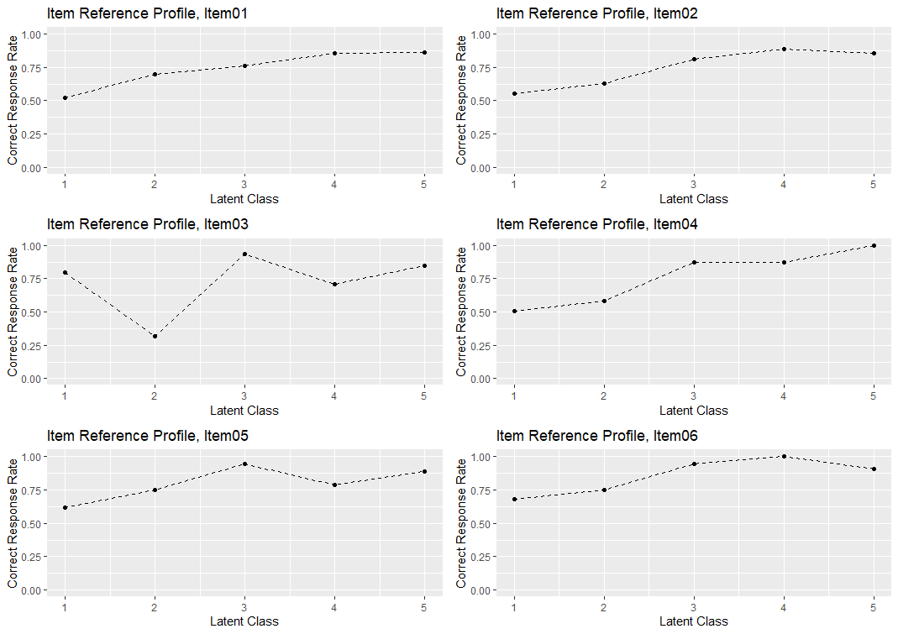

## ggExametrikaを作るきっかけ

私の指導教員である小杉先生が庄島先生のExametrikaというパッケージのR版への移植を行っているのですが、去年の夏に先生から「このExametrikaパッケージからggplot2で図を作成するggExamerikaってパッケージを作ってよ」と言われました。パッケージ開発なんてやったことないし、さぞ難しいと思っていたので冗談かと思い私は「あはは」と返したのですが先生に「いやまじで」と言われ、このggExametrikaパッケージを作成し始めました。

## やってみたら面白いぞパッケージ開発

とは言ったものの、パッケージ開発のやり方がわからないので書籍を読んだり、Webページを参考にパッケージ開発のやり方を調べ、ベースとなるプロジェクトを作りました。ここで、卒業論文を書かなければならなかったので、一旦開発は止まりましたが、卒論も終わり年明けから本格的に開発を始めました。


やっていることは自作関数を作ることに尽きるのですが、基となっているShojima(2022)のTest Data Engineeringを愚直に読みながら、Exametrikaパッケージ内の図とコードを参考に、ggplot2での描画を試みました。また、自分以外がその関数を使うこと意識しなければならないので、よりシンプルかつスマートな描画になるよう考えながらパッケージを作っていきました。中にはggplot2では表現できないような図も含まれていたので工夫し試行錯誤しながら図を作りました。そうこうしているうちに、いつの間にか関数がうまく動く喜びといつか誰かがこのパッケージを使ってくれのではというわくわくでのめり込んでやっていました。


これがパッケージ開発が面白いと言われる所以か(知ったか)

## 2/3まで終わってこんな感じ


プロットの様子を少しだけ載せます。上がExametrikaパッケージでの出力で、下がggExametrikaパッケージでの出力
```{r echo=FALSE}




```

これも。

```{r echo=FALSE}


knitr::include_graphics("images/TRP_gg.png")

```

両側に軸がある図も作ったよ。

```{r echo=FALSE}


```

こんなのも作りました。上がExametrikaパッケージの出力で下がggExametrikaの出力。

```{r echo=FALSE}


```

これはgeom_tileというヒートマップを作るような関数を応用して書いています(すごくね)

タイトルの有無や図の選択などのオプションを付けたりしてニヤニヤしてます。まだ試作品の段階なので、論文に載せやすいようなフォーマットを作って選択できるようにしたり、使用者が描画の後に変更を加えやすくするような形にしたいなーと思っています。
