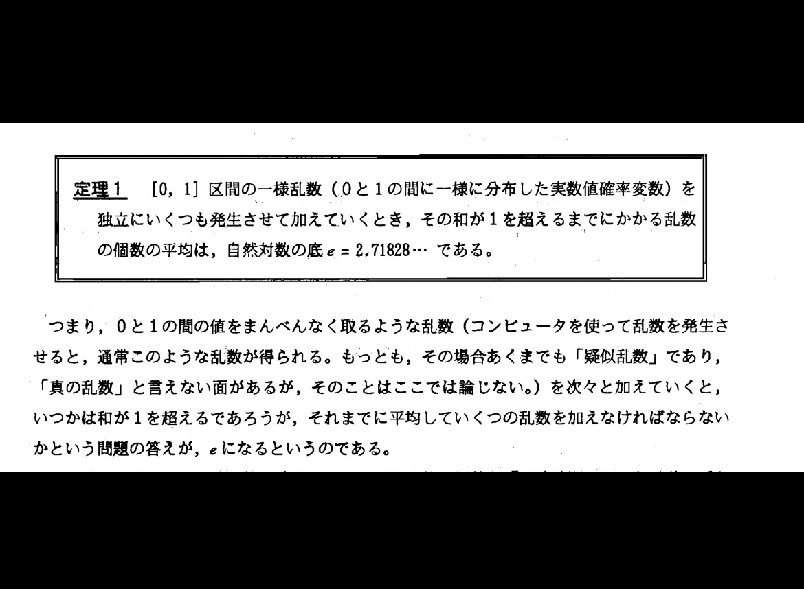

# なんか面白そうな定理発見

先日、X(旧ツイッター)にてこんな定理をつぶやいている人がいました。

```{r echo=FALSE}



```


なんこれということでやってみた(拙いコードごめん)


## まずは100回の平均を取ってみる


```{r 100s}
options(digits = 10)

set.seed(123)
k <- replicate(100, {
    s <- 0
    co <- 0
    
    while(s < 1){
        s <- s + runif(1, min = 0, max = 1)
        co <- co + 1
    }
    
    co
})

mean(k)
```

2.65かー。確かに回数増やしたらなりそうな予感はする。10000回やってみよう

## 1000回 

You can also embed plots, for example:

```{r 10000s, echo=FALSE}
options(digits = 10)

set.seed(123)
k <- replicate(10000, {
    s <- 0
    co <- 0
    
    while(s < 1){
        s <- s + runif(1, min = 0, max = 1)
        co <- co + 1
    }
    
    co
})

mean(k)
```

おー。2.7248はさっきより近いぞ。もっと増やそう。

## 100万回

```{r mores, echo=FALSE}
options(digits = 10)

set.seed(123)
k <- replicate(1000000, {
    s <- 0
    co <- 0
    
    while(s < 1){
        s <- s + runif(1, min = 0, max = 1)
        co <- co + 1
    }
    
    co
})

mean(k)
```

増やしすぎて計算に時間かかった。2.71836!!自然対数eに迫っている感はすごい!もうちょっと増やしたい。

## 泣きの1000万回
```{r toomores, echo=FALSE}
options(digits = 10)

set.seed(123)
k <- replicate(10000000, {
    s <- 0
    co <- 0
    
    while(s < 1){
        s <- s + runif(1, min = 0, max = 1)
        co <- co + 1
    }
    
    co
})

mean(k)
```

コードが悪いのかめっちゃ時間かかる。2.7185689...。コンピューター上のまるめ誤差とかが出ているのかもしれない。


## まとめ

確かに、[0,1]区間の一様分布から乱数を独立に発生させたら、和が1を超える平均の乱数の個数は自然対数になりそう。思い付きでやってみただけなので、今度また別の方法でしっかりやるかも