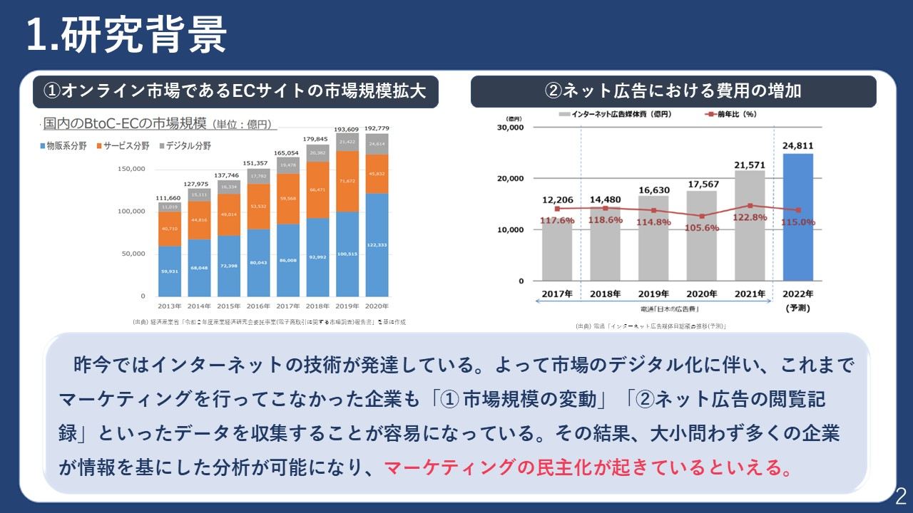

## 結論:賞は取れなかったけど楽しかった。

　私にとって人生初のコンペティション大会にして、大学３年生の思い出となった野村総合研究所のマーケティング分析コンテスト2022の結果が出ました。

　内容は多次元尺度構成法による商品の分類とPrefMapによる各属性を持つ人の好みを地図にすることで、誰もが直感的に理解できるマーケティング分析手法を提供するという内容でした。

　個人的には、地図化というユーモアと実用性を兼ね備えた面白い手法だと思ったのですが、やはりほかの分析に比べて決定打に欠けたのかなと感じました。それから、マーケティングという言葉の範囲がでかすぎてアイデアがイメージしづらかったですね。でもこの手法ってデータ分析がよくわからない人へのプレゼンなんかにめっちゃ向いてると思ってて、意外とデータマーケティングの分野では使えるんじゃと考えています。

人生で初めてビックデータに触れて分析する経験はとても貴重でした。まず何から手を付けてどのように加工・分析するかを学べました。各工程にかかる時間なんかも実体験として感じました(データの整理と加工にバカ時間かかる)。

　それでも毎日ゼミ室にメンバーで篭って、アイデア出しや分担作業を夜までやってたのは楽しかったですね。たまには気分を変えようと、IKEAに行ってご飯を食べながら作業したこともありました。入学からコロナでサークル等も参加していなかったので、初めて１つのことに協力して打ち込むことができてうれしかったです。青春でした。　

以下、提出したスライドの抜粋です。

