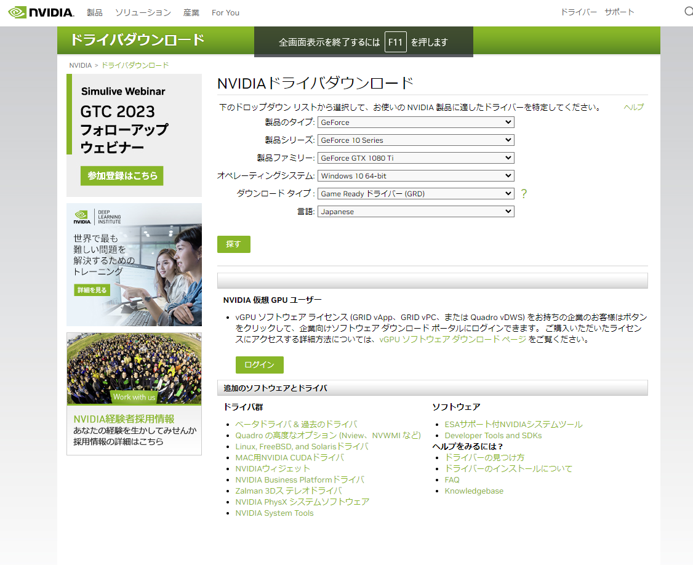
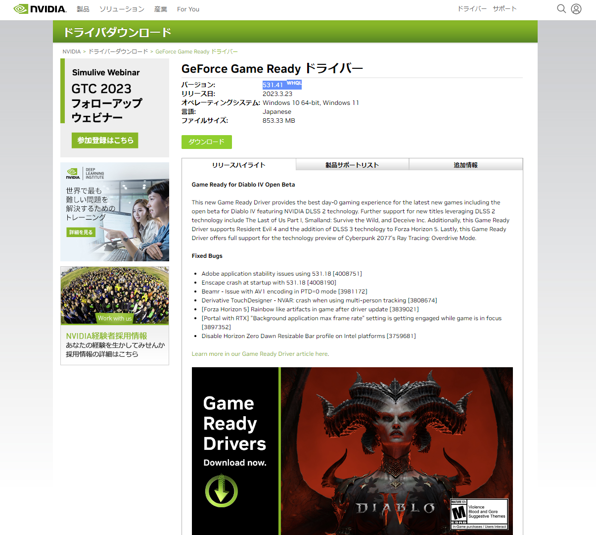
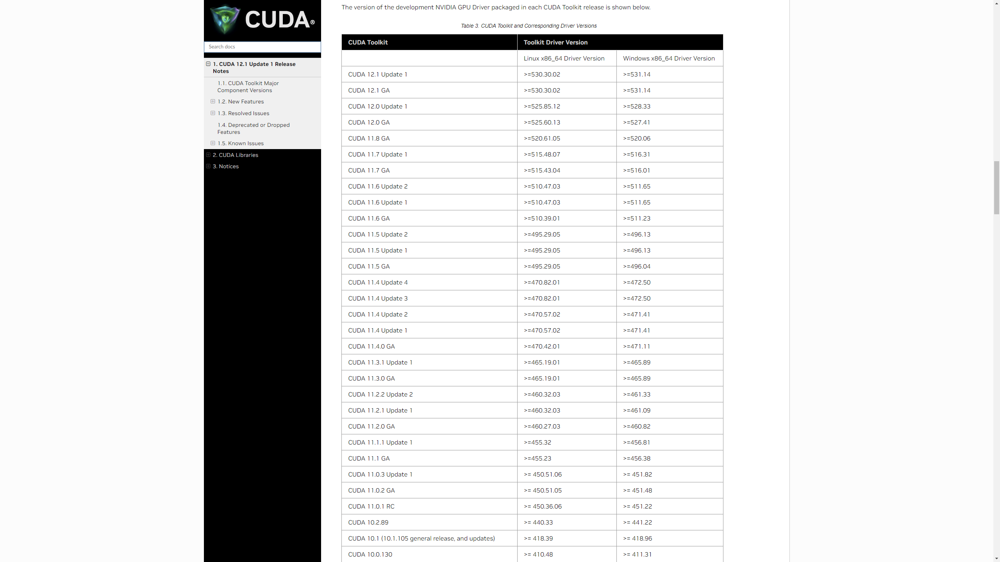
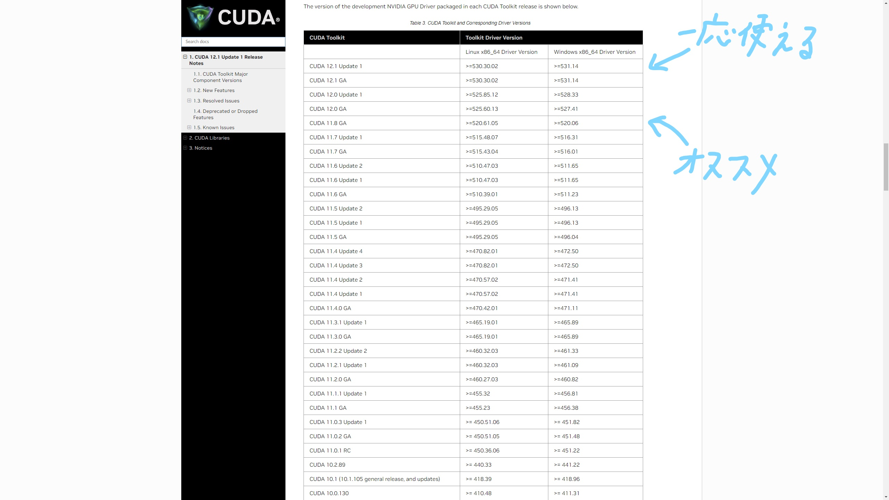
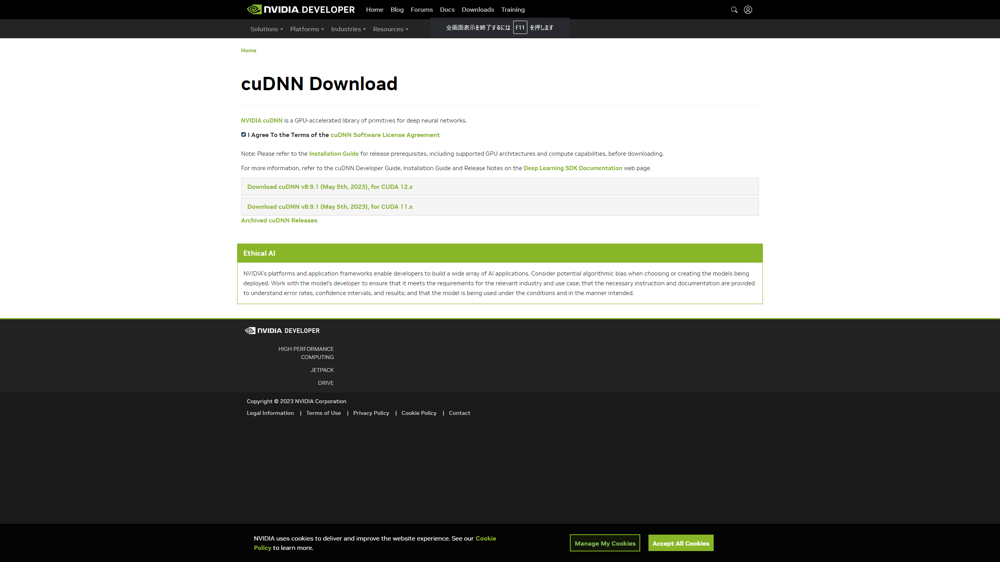
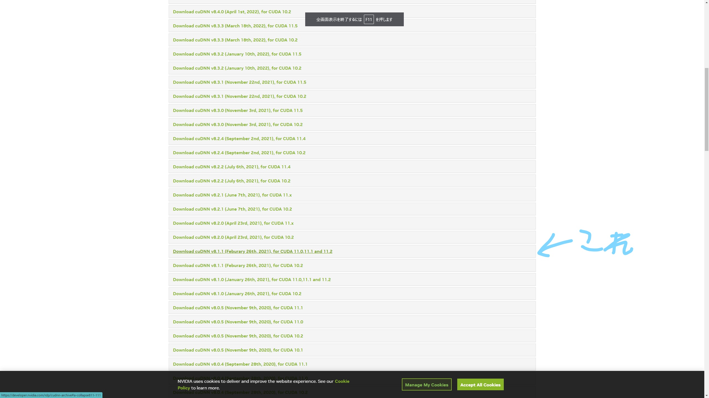

# きっかけ
　先日、行動計量学会の春セミナーに参加させていただき、モデリングの勉強をしながら様々な方と交流させていただきました。その中で、私が「RでGPUを使ってtensorflowを動かしている」という話になり、やり方を教えてほしいとお声をいただいたので記事にしてみます。


# 初めに
　私はRが大好きなので、できることならなんでもRでやりたがる人間です。加えて、tensorflowはPython用に作られているパッケージである点およびRでのすべての計算にGPUを使うことは不可能な点からあまりメリットはありません。それでも以下のようなメリットはあります。
　
　

・データの取得、加工から計算および可視化まで1つの言語で行える


・慣れ親しんだ記法でtensorflowを動かせる

  

特に、1つ目の利点は大きいです。Pythonでもデータ加工や分析は行えますが、統計的な処理や可視化にはRが向いていると私は考えています。なので、言語を切り替えることなく、最初から最後まですべての工程を行えることで、ヒューマンエラーの発生を少なくできるのは有用かと思います。

2つ目はRを普段から使っている方向けにはなりますが、慣れ親しんだ記法やパッケージを使ってデータの加工やモデルの構築ができるので、気が楽かなと思います。

あと、この記事を読んで試してPCが爆発する、データが吹っ飛ぶ等何があっても一切責任は負いませんので自己責任でお願いします。


# そもそもの発想
　Rで直接GPUに計算を任せることはできません(多分)。そこで発想としては「GPU版tensorflowを使えるPython環境を作る」+「Rからtensorflowを動かせるパッケージを使う」という形になります。

GPU版tensorflowをローカルで動かせる環境を作るのがめんどくさいです。Rでtensorflowを動かすパッケージはすでにあるのでそちらを使用します。


# Pythonの環境作り
では、実際に環境を作っていきます。

## 私の環境

OS: windows10
CPU: Intel(R) Core(TM) i5-11400


GPU: GeForce(R) GTX 1080Ti


メモリ: 32Gb

R環境
```{r}
R.version
```


Python環境
```{python}
#python version
import sys
print(sys.version)

#tensorflow version
import tensorflow as tf
print(tf.__version__)

#keras version
import keras
print(keras.__version__)

```


Rのバージョンは特にこだわる必要はなく、よほど古いバージョンじゃなければ大丈夫だと思います。Pythonに関してのちに記述しますが、バージョンが少しでも違うと動かなくなることがあります。

## GPUを使えるようにする環境の構築
まず、自身のGPUがtensorflow等の計算に使えるか以下のサイトで確認してください。なお、NVIDIA製のGPUでないと基本的にはできないと思います。AMD製でもできると噂では聞きましたが私はわからないです。
<https://developer.nvidia.com/cuda-gpus>

自身のGPUが使用できると分かったら、必要なソフトをインストールしていきます。

必要なソフトは3つ

・NVIDIA Driver


・CUDA


・cuDNN


これらはGPUの開発元であるNVIDIAからリリースされていて、GPUを計算に使うのに必要です。
1つずつインストールします。

### NVIDIA Driver
これはすでに入ってる人もいるかと思います。ない場合は下のサイトを開いて自分のGPUを選択してください。

<https://www.nvidia.co.jp/Download/index.aspx?lang=jp>

```{r echo=FALSE}

```

「探す」を押すと、ダウンロードの画面になるのでダウンロードしてください。

```{r echo=FALSE}

```

この時、バージョンと書かれている数字を後で使うのでメモを取るか覚えておいてください。


### CUDA

次にCUDAを入れていきます。CUDAはGPUを深層学習などの計算に使うために必要なツールキットです。

<https://docs.nvidia.com/cuda/cuda-toolkit-release-notes/index.html>

ここで、先ほどのNVIDIA Driverのバージョンが関係してきます。下の画像でDriverのバージョンが小さいやつが使えます。例えば、私はDriverのバージョンが531.41なので最新のCUDAが使えることになります。


```{r echo=FALSE}

```


しかし、さらに注意するべき点があります。私が確認した中ではCUDAの数字が12のやつはTensorFlowがGPUで動きませんでした(最新版はまだtensorflow for GPUに対応されてないのかも？)。なので、11.xのCUDAを入れることをお勧めします。

```{r echo=FALSE}

```

よって、「自分のバージョンで使える」かつ「CUDA 11.x」のCUDAをダウンロードしてください。


### CuDNN

最後にcuDNNをインストールします。cuDNNはGPUでディープニューラルネットワークへの使用のために必要なライブラリです。

まず、下のURLに飛んでDownload cuDNNをクリックします。この時、NVIDIAへのログインを求められるので登録するかログインしてください。

<https://developer.nvidia.com/cudnn>


そしたら、Agreeにチェックを入れると次のような画面になるのでArchiveをクリックします。

```{r echo=FALSE}

```


するといままでリリースされたバージョンが出てくるのでcuDNNのバージョンが8.1.xでfor CUDAに11.0,11.1 and 11.2のものをダウンロードしてください。

```{r echo=FALSE}

```


## RstudioからGPUを動かせるようにする

condaやVScodeなどで仮想環境でのpython環境を作ります。この際、pythonのバージョンは3.7から3.10の間で作ってください(私は3.9.13)。そしたら、R側でそのpythonを選択してください。Rstudioなら左上の「Tools」→「Global Options」→「Python」→「Select」から選べます。


そしたら、Rでtensorflowを動かすためのパッケージを入れます。

```{r eval=FALSE, include=TRUE}
install.packages("keras")
install.packages("tensorflow")

library(keras)

install_keras(tensorflow = "gpu",version = "2.10.0")

```

一、二行目でkerasパッケージとTensorFlowパッケージをインストールし、三行目でkerasパッケージを呼び出す。四行目でkerasパッケージからtensorflowをGPU版のバージョン2.10.0でダウンロードします。結構時間がかかった気がします。


```{r}
library(tensorflow)
tf$config$list_physical_devices("GPU")
```

この時、出力結果にGPUが表示されればR上でtensorflowを動かすときにGPUが使われます。結構大変でしたね。これで動かない場合は、自動で追加されるはずのPATHが追加されていなかったり、Pythonのバージョンが間違っていたりといろいろな原因が考えられるので、ほかのサイトも参考にして解決してみてください。


